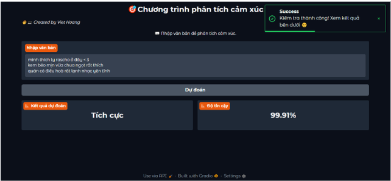

# Sentiment Analysis using BERT, BERT+RCNN, and BERT+LSTM

## 📌 Overview

This project focuses on sentiment analysis using pre-trained BERT models and enhanced architectures such as BERT+RCNN and BERT+LSTM. The goal is to classify text into different sentiment categories (e.g., positive, negative) with high accuracy and robustness across various datasets.

## 📂 Project Structure
```
├── Dataset/ # Datasets and preprocessed files
|  |-- Data
|   |- NTC_SV # Folder have dataset NTC_SV with test and train
|-- FixAllNotebook
│  |-- BERT-BASE-256-FOODY-PYTORCH # Notebook using Bert model
│  |-- BERT-RCNN-256-FOODY-PYTORCH # Notebook using Bert + RCNN
|  |-- BERT-LSTM-256-FOODY-PYTORCH # Notebook using Bert + LSTM
├── BERT-base 
│  |-- app.py # UI gradio using BERT
├── BERT-embedding-CNN 
│  |-- app.py # UI gradio using BERT + RCNN
├── BERT-embedding-LSTM
│  |-- app.py # UI gradio using BERT + LSTM
└── README.md
```

# Optional Create venv
> In the directory containing the project, run the following command to create the virtual environment `venv`:

```bash
python -m venv myenv
```

Or install from the path with the sample path below:
```bash
H:\AnacondaApp\envs\Sentiment_env\python.exe -m venv myenv
```

> After creating the virtual environment, activate it with the command

```bash
myenv\Scripts\activate
```

> You can also disable venv if needed with the command

```bash
deactivate
```

## 🚀 Quick Start

### 1. Clone the repository
```bash
git clone https://github.com/VietHoang0805/SentimentAnalystComment.git
cd BERT-base
```

### 2. Install dependencies
```bash
pip install -r requirements.txt
```

> You can run source [Python UI](BERT-base/app.py) by using :
```bash
gradio app.py
```

After run Python UI you can see below:


Model evaluation

| Model       | Precision | Recall   | F1 score  |
| ----------- | --------  | -------- | --------  |
| BERT        |   88%     | 91%     |     90%    |
| BERT + LSTM |   88%     | 90%     |     89%    |
| BERT + RCNN |   87%     | 83%     |     85%    |

